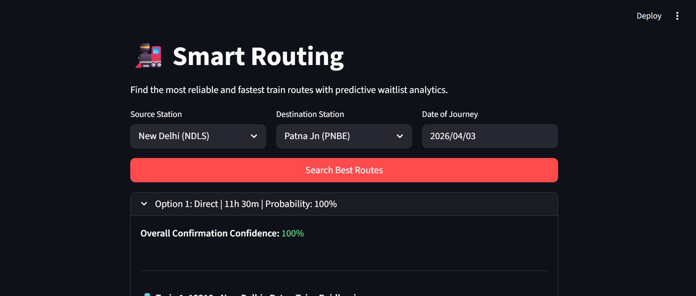
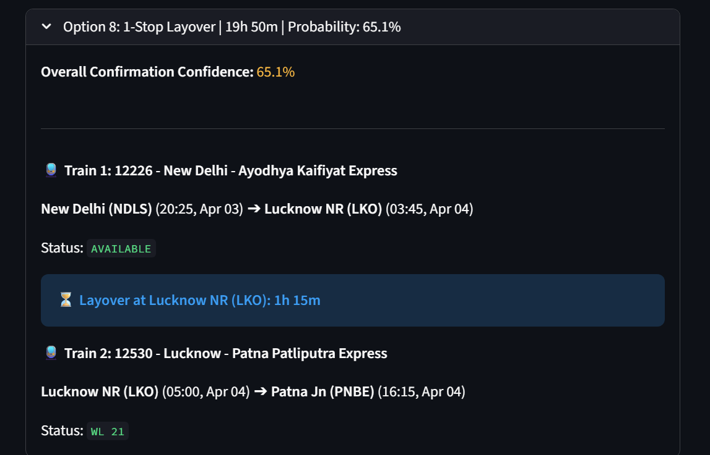
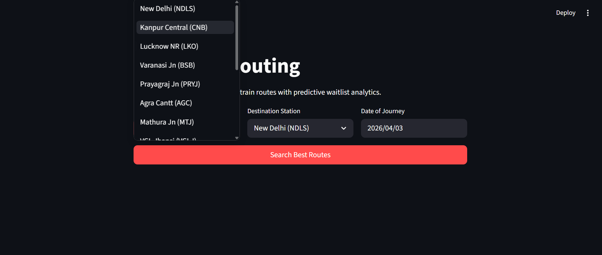
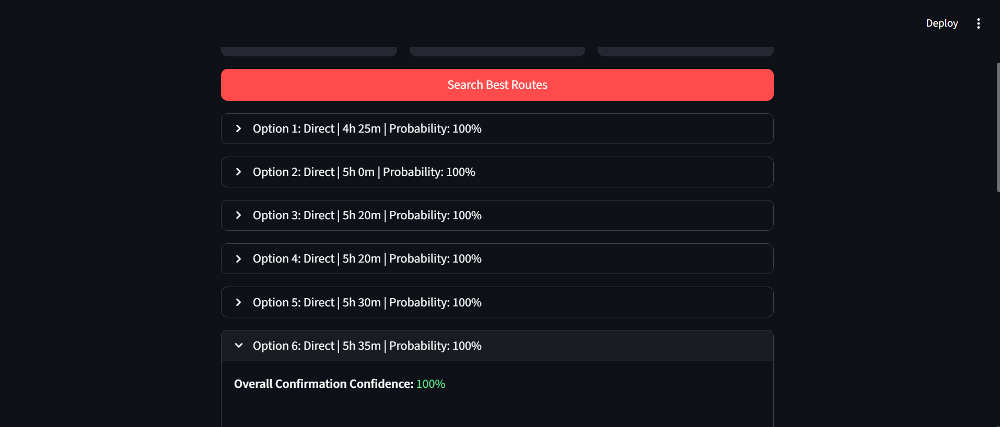

# 🚆 Railway Planner

> A full-stack train route planning and seat availability prediction system, built with **FastAPI** (backend) and **Streamlit** (frontend), powered by graph-based routing algorithms and a synthetic but realistic Indian Railways dataset.

---

## 📌 Table of Contents

1. [Why I Built This](#-why-i-built-this)
2. [What It Does](#-what-it-does)
3. [Live Demo Screenshots](#-live-demo-screenshots)
4. [Architecture Overview](#-architecture-overview)
5. [How It Works — Step by Step](#-how-it-works--step-by-step)
6. [Technical Concepts Explained](#-technical-concepts-explained)
7. [Project Structure](#-project-structure)
8. [Dataset Details](#-dataset-details)
9. [API Reference](#-api-reference)
10. [Installation & Running the Project](#-installation--running-the-project)
11. [Seat Availability Logic](#-seat-availability-logic)
12. [Design Decisions](#-design-decisions)
13. [Known Limitations & Future Scope](#-known-limitations--future-scope)

---

## 💡 Why I Built This

Indian Railways is one of the most complex transportation networks in the world — millions of passengers, thousands of trains, and a notoriously opaque ticketing system. Finding out whether your train ticket will get confirmed from a Waiting List is a frustrating experience that involves guesswork and third-party tools.

I built this project to:

- **Understand how route-planning algorithms work in practice** — not just on paper, but in a real system where trains have intermediate stops, overnight journeys cross midnight, and layovers must be timed carefully.
- **Model the Indian Railways seat allocation system** — including the RAC (Reservation Against Cancellation) queue and Waiting List (WL), and reason about confirmation probabilities.
- **Practice building a decoupled full-stack application** — where the backend is a proper REST API (FastAPI) and the frontend is a reactive UI (Streamlit) that consumes it, instead of a monolithic script.
- **Explore AI-assisted data generation** — using Google's Gemini to create realistic, validated train schedule data.

This is not a toy CLI script. It follows real software architecture patterns: a graph model for the rail network, a REST API for computation, and a dedicated UI layer for presentation.

---

## 🎯 What It Does

The Railway Planner lets a user input a **source station**, **destination station**, and **date of journey**. The system then:

1. Searches for all **direct train routes** between those two stations.
2. Searches for all **one-stop (layover) routes** — where you catch a connecting train at an intermediate hub, with a layover window of **30 minutes to 12 hours**.
3. For each route found, it checks the **seat availability dataset** and computes:
   - Whether seats are **AVAILABLE**, in **RAC** (Reservation Against Cancellation), on the **Waiting List (WL)**, or in **REGRET** (no chance of confirmation).
   - A **Confirmation Probability (%)** — a score from 0 to 100 representing the likelihood of your ticket getting confirmed.
4. Results are **sorted by total travel time** (shortest first) and then by highest probability, and the top 10 options are displayed.

---

## 📸 Live Demo Screenshots

> Screenshots are located in the `/images` folder of this repository.

| Search Interface | Route Results |
|---|---|
|  |  |
|  |  |

---

## 🏗️ Architecture Overview

```
┌─────────────────────────────────────────────────────────────┐
│                       User's Browser                        │
└──────────────────────────┬──────────────────────────────────┘
                           │  HTTP (localhost)
                           ▼
┌─────────────────────────────────────────────────────────────┐
│              frontend.py  (Streamlit App)                   │
│  - Station selection dropdowns                              │
│  - Date picker                                              │
│  - Calls GET /routes on the FastAPI backend                 │
│  - Renders results: train names, times, status, probability │
└──────────────────────────┬──────────────────────────────────┘
                           │  REST API call (requests library)
                           ▼
┌─────────────────────────────────────────────────────────────┐
│              backend.py  (FastAPI Server)                   │
│  - Loads train_dataset.json and seat_dataset.json at boot   │
│  - Builds a graph of all possible train edges               │
│  - On GET /routes: runs direct + 1-layover route search     │
│  - Computes seat availability and confirmation probability  │
│  - Returns top 10 routes as JSON                            │
└──────────────────────────┬──────────────────────────────────┘
                           │  File I/O (loaded once at startup)
                           ▼
┌─────────────────────────────────────────────────────────────┐
│                     JSON Datasets                           │
│  train_dataset.json  — 100 trains, routes, schedules        │
│  seat_dataset.json   — seat counts per train per leg/date   │
└─────────────────────────────────────────────────────────────┘
```

**Key architectural choice:** The backend and frontend are completely decoupled. The backend is a pure REST API with no UI knowledge; the frontend is a pure UI with no routing logic. This means you could swap out Streamlit for React, or replace FastAPI with Flask, without touching the other side.

---

## 🔍 How It Works — Step by Step

### Step 1: Data Loading (at server startup)

When `backend.py` starts, it immediately loads both JSON files into memory:

```python
with open("train_dataset.json", "r") as f:
    TRAINS = json.load(f)

with open("seat_dataset.json", "r") as f:
    SEAT_DATA = json.load(f)
```

The seat data is then re-indexed into a fast lookup dictionary keyed by `(date, train_number)` so that availability checks are O(1) rather than a linear scan:

```python
SEAT_LOOKUP[date][train_number] = leg_availability
```

### Step 2: Building the Edge Graph

Each train in the dataset has 4 stops: `src → first_stop → second_stop → dest`. The `build_edges()` function generates **every possible sub-journey** from this — not just the full route, but every combination of intermediate stops:

- `src → first_stop`
- `src → second_stop`
- `src → dest`
- `first_stop → second_stop`
- `first_stop → dest`
- `second_stop → dest`

This gives 6 edges per train, and 600 edges total across 100 trains. Each edge stores the departure time, arrival time, duration in minutes, and which "legs" (segments) it covers. This is crucial for the seat availability check — a journey from `src` to `dest` that passes through both intermediate stops needs availability on *all* the legs it covers.

The function also handles the **midnight crossing problem**: if a train departs at 22:00 and arrives at 02:00, the raw time arithmetic would give a negative duration. The code detects time going backwards and adds a 1440-minute (1 day) offset to the duration.

### Step 3: Route Finding (on each API request)

**Direct Routes:** Simple — filter all edges where `edge.src == query_src` and `edge.dest == query_dest`.

**One-Layover Routes:** A nested loop finds all pairs of edges `(leg1, leg2)` where `leg1.dest == leg2.src` (they share an intermediate hub), then checks:

- `leg2` departs at least **30 minutes** after `leg1` arrives (enough time to de-board, cross the platform, and board). This is the minimum layover constraint.
- The layover is no more than **12 hours** (720 minutes) — to avoid routes that technically "work" but are impractically long.
- If `leg2`'s departure time string is earlier in the day than `leg1`'s arrival, it means you're catching the connecting train the *next day*, so `leg2`'s datetime is bumped forward by 1 day.

### Step 4: Seat Availability & Confirmation Probability

For each route found, the system looks up `SEAT_LOOKUP[date][train]` and finds the **minimum available seats** across all legs of the journey. This minimum-seat approach is correct: if one segment of your journey has only 10 seats left but another has 200, you're constrained by the scarce segment.

The seat count is then mapped to a status and probability (detailed in the [Seat Availability Logic](#-seat-availability-logic) section below).

### Step 5: Sorting and Returning Results

Routes are sorted by `(total_time_mins ASC, overall_prob DESC)` — shortest journey first, then by highest confirmation probability as a tiebreaker. The top 10 are returned as JSON.

---

## 🧠 Technical Concepts Explained

### Graph Theory & Edge Representation

The rail network is modelled as a **directed weighted graph**:
- **Nodes** = railway stations
- **Edges** = train journeys between pairs of stations
- **Weight** = travel duration in minutes

Rather than building an explicit adjacency list and running Dijkstra's algorithm end-to-end, this project takes a pragmatic approach: it pre-computes all possible edges (including sub-journeys) at startup, then filters them at query time. This works well for the scale of 100 trains with 4 stops each. For a network of thousands of trains, a proper Dijkstra or A* implementation on a lazy graph would be more efficient.

### Why FastAPI?

FastAPI is an **asynchronous** Python web framework built on top of Starlette and Pydantic. Key reasons to choose it here:

- **Automatic API docs**: FastAPI auto-generates interactive Swagger UI at `/docs` — you can test the `/routes` endpoint directly in your browser without writing any extra code.
- **Type hints**: Python type annotations double as request validation — FastAPI automatically returns a `422 Unprocessable Entity` if you pass a malformed date string.
- **Speed**: FastAPI is one of the fastest Python frameworks available, competitive with Node.js, because it is built on async I/O primitives. This matters for a routing engine that might handle many concurrent requests.
- **Uvicorn**: FastAPI runs on Uvicorn, an ASGI server (Asynchronous Server Gateway Interface), which is the modern Python equivalent of the older WSGI standard used by Flask/Django.

### Why Streamlit?

Streamlit lets you build interactive web UIs **entirely in Python**, with no HTML, CSS, or JavaScript required. Every time the user interacts with a widget (clicks a button, changes a dropdown), the entire Python script re-runs top to bottom, and Streamlit efficiently re-renders only the parts that changed.

This makes it ideal for data applications and internal tools where developer speed matters more than pixel-perfect design. The tradeoff is less flexibility compared to building a React frontend.

### The RAC System

RAC stands for **Reservation Against Cancellation**. In Indian Railways:

- When confirmed berths are sold out, the next passengers are placed in RAC — they get a **seat** (not a berth) and share a berth with another RAC passenger.
- If any confirmed passenger cancels, the first RAC passenger gets upgraded to a full berth.
- RAC passengers *are* guaranteed to board the train.

In this system, a "seat count" of 0 means all confirmed berths are sold. Negative counts represent the queue: -1 to -50 means RAC positions 1 through 50, and below -50 means Waiting List positions.

### REST API Design

The backend exposes a single endpoint:

```
GET /routes?src={station_code}&dest={station_code}&date={YYYY-MM-DD}
```

This follows REST principles — it's stateless (all information needed is in the query parameters), uses a standard HTTP method (GET, since it's a read-only query), and returns JSON. The frontend communicates with it using Python's `requests` library, just like any HTTP client would.

### Confirmation Probability Formula

For one-stop routes, the overall confirmation probability is calculated as:

```
P(both legs confirmed) = P(leg1) × P(leg2)
```

This treats the two legs as **independent events** — the probability that *both* legs get confirmed is the product of their individual probabilities. This is a simplification (in reality the cancellation rates on one leg might correlate with the other), but it's a reasonable and interpretable approximation.

### Synthetic Dataset Generation

The train schedule data was generated using **Google's Gemini** — an LLM was prompted to produce realistic train numbers, names, routes, and schedules for 100 trains on the North Indian rail network. The output was then validated in Python (via Google Colab) to ensure time consistency (e.g., departure times are ordered correctly along the route). Seat availability data was generated using Python's `random` module to simulate a range of availability states — from fully open to overbooked — across a 10-day window.

---

## 📂 Project Structure

```
Railway-Planner/
│
├── backend.py                      # FastAPI routing engine
│   ├── Data loading & SEAT_LOOKUP  # Builds fast lookup at startup
│   ├── build_edges()               # Generates all train sub-journey edges
│   ├── get_availability()          # Maps seat count → status + probability
│   └── GET /routes                 # Main API endpoint
│
├── frontend.py                     # Streamlit UI
│   ├── STATION_MAP                 # Display names → station codes
│   ├── TRAIN_MAP                   # Train numbers → full train names
│   ├── Station/date selectors      # Input widgets
│   └── Results renderer            # Expandable cards per route option
│
├── Railway_dataset_generator.ipynb # Jupyter Notebook for dataset creation
│   ├── Gemini API prompting        # LLM-generated train schedules
│   └── Validation logic            # Checks time ordering & consistency
│
├── train_dataset.json              # 100 trains with full schedule info
├── seat_dataset.json               # Seat availability (Apr 1–10)
├── images/                         # UI screenshots
└── .gitignore
```

---

## 📊 Dataset Details

### `train_dataset.json`

Each train record contains:

| Field | Description | Example |
|---|---|---|
| `train_number` | Unique numeric ID | `22436` |
| `src` | Source station code | `"NDLS"` |
| `first_stop` | First intermediate stop code | `"AGC"` |
| `second_stop` | Second intermediate stop code | `"CNB"` |
| `dest` | Destination station code | `"BSB"` |
| `src_departure_time` | Departure time from source | `"06:00"` |
| `first_stop_departure_time` | Departure from 1st stop | `"08:15"` |
| `second_stop_departure_time` | Departure from 2nd stop | `"10:30"` |
| `destination_arrival_time` | Arrival at destination | `"13:00"` |

The 15 stations in the network are all major junctions in Uttar Pradesh, Madhya Pradesh, and Bihar — chosen to represent a realistic but tractable subgraph of the North Indian rail network.

### `seat_dataset.json`

Each record covers one train on one date:

| Field | Description |
|---|---|
| `train_number` | Train identifier |
| `journey_start_date` | Date string (`"2026-04-01"` to `"2026-04-10"`) |
| `leg_availability` | Dictionary mapping each leg (e.g. `"NDLS-AGC"`) to an integer seat count |

**Seat count interpretation:**
- `> 50` → Plenty of seats available
- `0 to 50` → Available but filling up
- `-1 to -50` → RAC queue (positions 1–50)
- `-51 to -99` → Waiting List (positions 1–49)
- `< -99` → REGRET (no chance of boarding)

---

## 🔌 API Reference

### `GET /routes`

Find optimal train routes between two stations on a given date.

**Query Parameters:**

| Parameter | Type | Required | Description |
|---|---|---|---|
| `src` | string | Yes | Source station code (e.g., `NDLS`) |
| `dest` | string | Yes | Destination station code (e.g., `BSB`) |
| `date` | string | Yes | Journey date in `YYYY-MM-DD` format |

**Example Request:**
```
GET http://127.0.0.1:8000/routes?src=NDLS&dest=BSB&date=2026-04-05
```

**Example Response:**
```json
{
  "status": "success",
  "routes": [
    {
      "type": "Direct",
      "total_time_mins": 420.0,
      "overall_prob": 95.0,
      "min_seats": 80,
      "transfer_mins": 0,
      "route_legs": [
        {
          "train": 22436,
          "src": "NDLS",
          "dest": "BSB",
          "dep_dt": "2026-04-05 06:00",
          "arr_dt": "2026-04-05 13:00",
          "status": "AVAILABLE"
        }
      ]
    },
    {
      "type": "1-Stop Layover",
      "total_time_mins": 560.0,
      "overall_prob": 72.5,
      "min_seats": -30,
      "transfer_mins": 90,
      "route_legs": [
        { "train": 12034, "src": "NDLS", "dest": "CNB", "status": "AVAILABLE", "..." : "..." },
        { "train": 15128, "src": "CNB",  "dest": "BSB", "status": "RAC 20",     "..." : "..." }
      ]
    }
  ]
}
```

**Interactive Docs:** Once the server is running, visit `http://127.0.0.1:8000/docs` for the auto-generated Swagger UI.

---

## 🚀 Installation & Running the Project

### Prerequisites

- Python 3.8 or higher
- pip

### 1. Clone the repository

```bash
git clone https://github.com/ppsspp18/Railway-Planner.git
cd Railway-Planner
```

### 2. Install dependencies

```bash
pip install fastapi uvicorn streamlit python-dateutil requests
```

### 3. Start the backend (FastAPI)

Open a terminal and run:

```bash
uvicorn backend:app --reload
```

The server starts at `http://127.0.0.1:8000`. You can verify it's running by visiting `http://127.0.0.1:8000/docs`.

### 4. Start the frontend (Streamlit)

Open a **second terminal** in the same directory and run:

```bash
streamlit run frontend.py
```

Streamlit will automatically open `http://localhost:8501` in your browser.

> ⚠️ **Both processes must be running simultaneously.** The Streamlit frontend makes HTTP requests to the FastAPI backend. If the backend is not running, you will see a connection error in the UI.

---

## 🎟️ Seat Availability Logic

The system models the three-tier Indian Railways ticketing queue:

```
Seat Count    │  Status          │  Probability
──────────────┼──────────────────┼─────────────────────────────
> 50          │  AVAILABLE       │  100%
0 to 50       │  AVAILABLE       │  100%  (seats filling up)
-1 to -50     │  RAC {n}         │  100%  (guaranteed boarding)
-51 to -99    │  WL {n}          │  20% – 99%  (linear scale)
< -100        │  REGRET          │  0%
```

**Why is RAC probability 100%?** RAC passengers are guaranteed a seat on the train (they share a berth). They will board regardless. The question of whether they get upgraded to a full berth depends on cancellations, but from a *boarding* perspective, RAC = confirmed travel.

**Waiting List probability formula:**
```python
prob = round(20 + (min_seats - (-99)) * (79 / 49), 1)
```
This is a linear interpolation between 20% (at WL ~49, deep in the queue) and ~99% (at WL 1, first on the list). The intuition: even WL 1 isn't 100% because cancellations aren't guaranteed.

**For one-stop routes**, the overall probability is:
```
P(route) = P(leg1) / 100 × P(leg2) / 100 × 100
```

---

## 🧩 Design Decisions

**Why JSON instead of a database?** For a dataset of 100 trains over 10 days, a full database (SQLite, PostgreSQL) would add operational complexity with no meaningful performance benefit. JSON files loaded into memory at startup give sub-millisecond lookup times and zero infrastructure dependencies — anyone can clone and run this project immediately.

**Why pre-compute all edges instead of running Dijkstra on-the-fly?** With 100 trains × 6 edges each = 600 edges, pre-computation is cheap (done once at startup). Dijkstra would add code complexity without any benefit at this scale. The current approach also makes it trivial to enumerate *all* valid routes, not just the single shortest path — which is what a user actually wants to see.

**Why limit to 1 layover?** In practice, routes with 2+ layovers are rarely practical for travellers — the cumulative probability of confirmation drops sharply, and the total journey time becomes prohibitive. Limiting to 1 layover keeps the search space tractable and the results user-friendly.

**Why 30 minutes as the minimum layover?** Indian Railways platforms can be large and crowded. A 30-minute window is the minimum reasonable time to de-board, potentially cross platforms, and board the next train. Anything less risks missing the connection if the first train is even slightly delayed.

---

## ⚠️ Known Limitations & Future Scope

**Current limitations:**

- The dataset covers only 15 stations and 100 trains. The real Indian Railways network has ~8,000 stations and ~14,000 trains.
- Seat availability data is static (pre-generated for April 1–10, 2026). There is no real-time integration with the actual IRCTC system.
- Train delays are not modelled. In reality, a 30-minute layover might be risky if the first train is frequently late on that route.
- The probability formula is a heuristic, not trained on real cancellation data.

**Potential future enhancements:**

- Integrate with the [RailYatri](https://www.railyatri.in/) or [IRCTC](https://www.irctc.co.in/) APIs for real-time seat data.
- Add a proper graph with Dijkstra/A* for multi-hop routing beyond 1 layover.
- Incorporate historical delay data per train to adjust layover safety margins.
- Add fare estimation based on class (Sleeper, 3A, 2A, 1A) and distance.
- Deploy on a cloud platform (Render, Railway, or AWS) with Docker.
- Add user authentication and the ability to save and compare routes.

---

## 🛠️ Tech Stack

| Layer | Technology | Purpose |
|---|---|---|
| Backend | Python + FastAPI | REST API, routing logic |
| Server | Uvicorn (ASGI) | Async HTTP server |
| Frontend | Streamlit | Interactive UI |
| HTTP Client | `requests` | Frontend → backend calls |
| Data | JSON files | Train and seat datasets |
| Dataset Gen | Google Gemini + Python | AI-assisted synthetic data |
| Notebook | Jupyter (Google Colab) | Dataset validation |

---

## 👤 Author

**Prakhar** — Student at IIT Kanpur

- GitHub: [@ppsspp18](https://github.com/ppsspp18)
- Repository: [Railway-Planner](https://github.com/ppsspp18/Railway-Planner)

---

*Built as a project to explore graph algorithms, REST API design, and full-stack Python development.*
